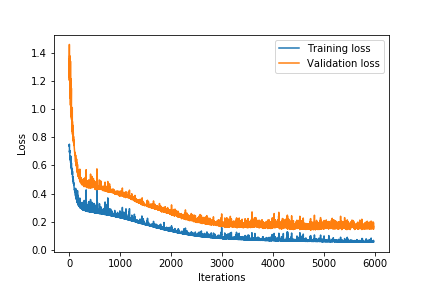
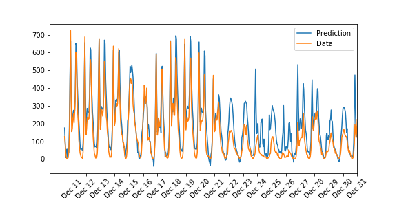
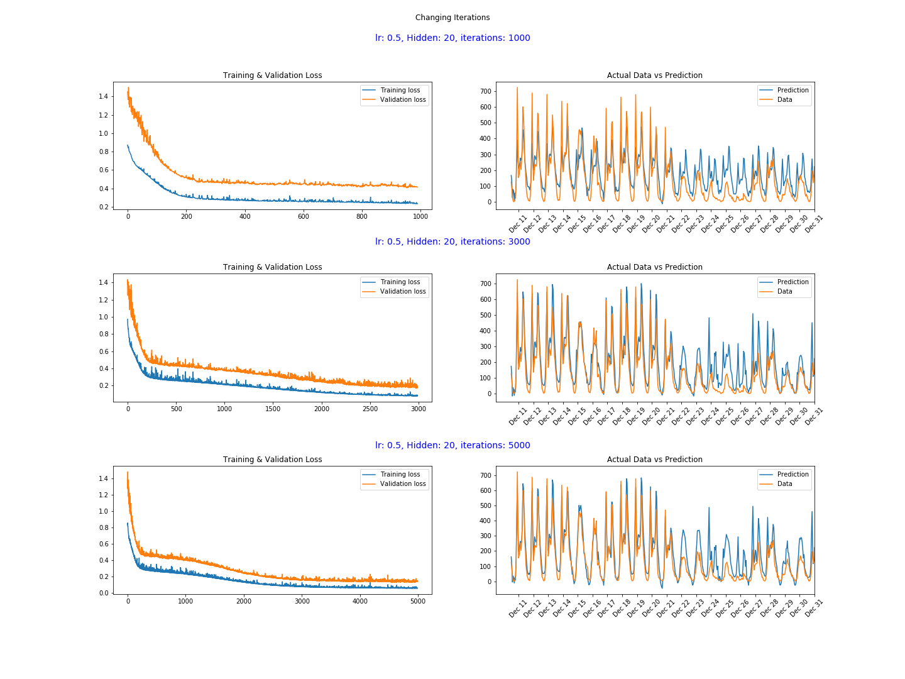
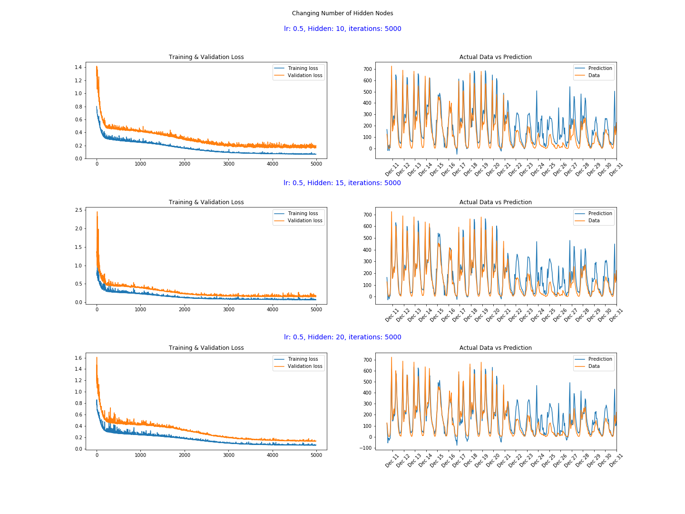
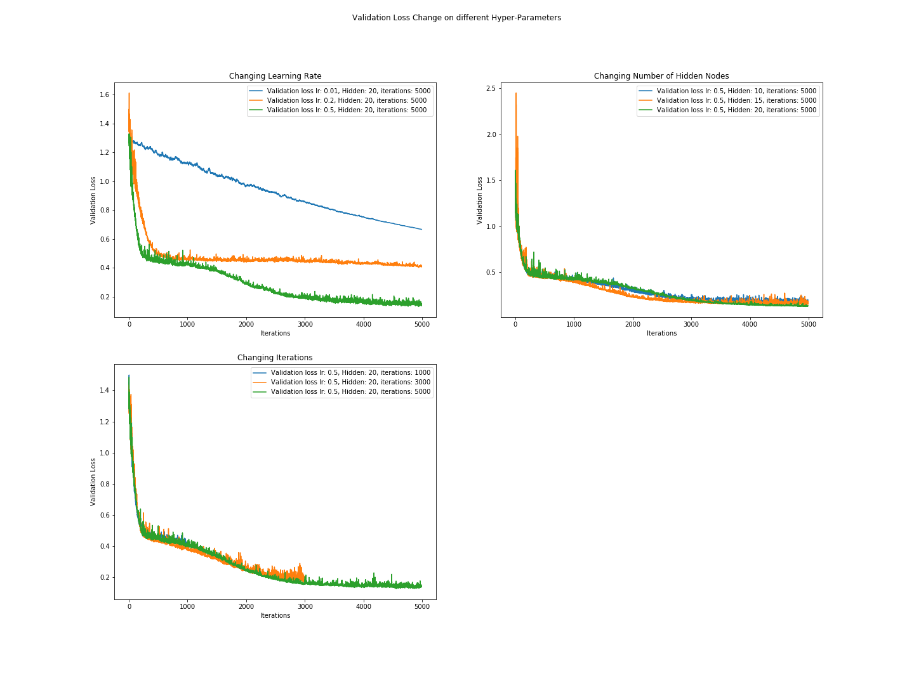

# Bike-Sharing-Prediction-Neural-Networks

Developed as a course project in Udacity's **Deep Learning Nanodegree** Program.

The objective of this project is to build a Neural Network from scratch to predict bike rentals daily on an hourly basis.

## Project Details:

* Built a neural network from scratch using Numpy
* Implement sigmoid activation function.
* Implement Forward pass in a Neural Network.
* Calculate the Mean Squared Error and Gradients of Error to propagate backwards.
* Implement Backward pass to update the weights of the Network (Gradient Descent).
* Try different - number of hidden layers, learning rates and training iterations.
* After 6000 iterations, *Training loss: 0.058* and *Validation loss 0.140* was achieved with a *learning rate: 0.5* and *Hidden Nodes: 20*.

## Setup:

To run this project follow these steps:

* Make sure you have Anaconda or Miniconda Package manager installed.
* Open Terminal and type the following commands:
* Clone this repository: `git clone https://github.com/anubhavshrimal/Bike-Sharing-Prediction-Neural-Networks.git`
* `cd Bike-Sharing-Prediction-Neural-Networks`
* `conda env create -f environment.yaml`
* `source activate bike-sharing-prediction`
* `jupyter notebook`
* Open: `Your_first_neural_network.ipynb`

## Performance:

Following are the Training and Validation losses and the predictions made by the Neural Network:

## Inferences:

* The neural network doesn't perform well over the period of Dec 22 - 31 as it can be seen from the above plot.
* The reason for this is because the network had never seen the data of Decemeber Holiday Season when people do not generally go to their offices and hence would not be renting bikes.
* This gives us an important insight that the network needs more data to learn these patterns.
* Also, an additional feature in the dataset marking holiday on a particular day could be helpful as well.

## Analysis:

Different learning rates, Number of Iterations and Number of Hidden Nodes were tried to see the effects of these hyper parameters. Following are the analysis produced:

